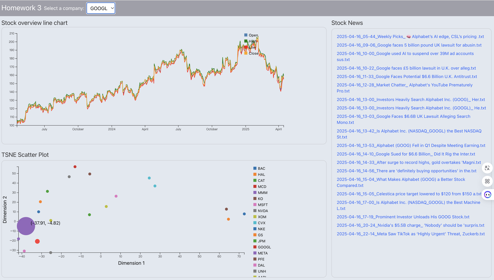
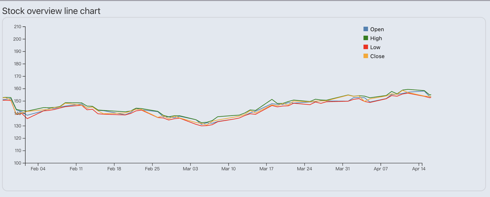
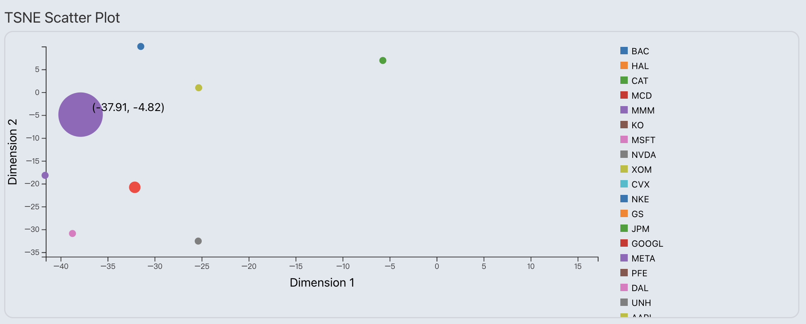
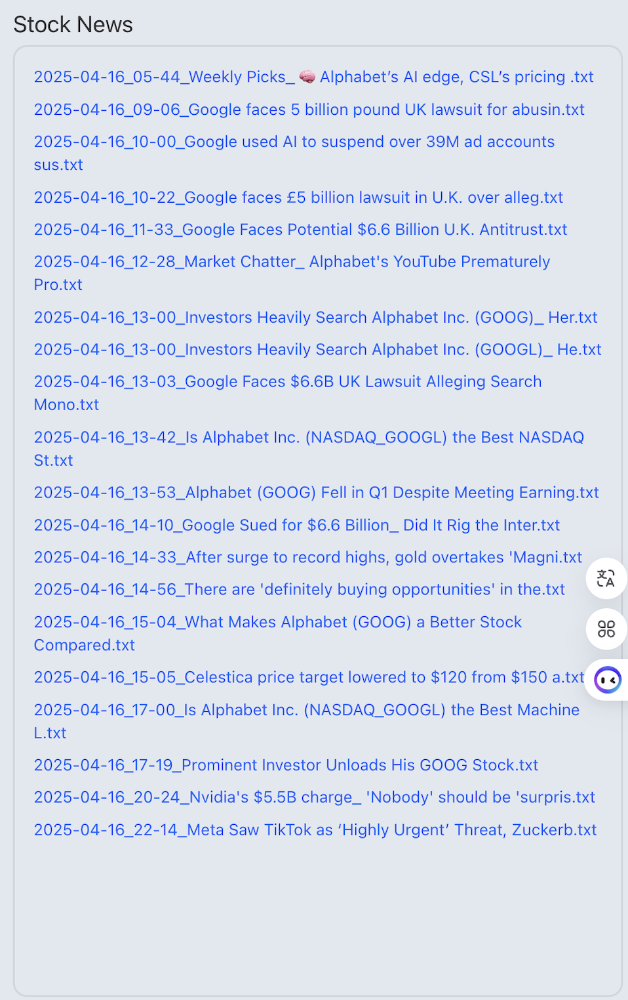

# 📊 Homework3: Interactive Stock Visualization Dashboard

This project is a web-based financial dashboard that visualizes stock data using **React**, **D3.js**, and **Node.js**. It provides interactive components for time-series stock trends, t-SNE dimensionality reduction visualization, and related financial news.


---

## 🚀 How to Run This Project

### 🔧 Prerequisites

* Node.js (v16+)
* npm

### 🛠 Setup

1. Clone the repository

```bash
cd Homework3/ciqchen
```

2. Install dependencies

```bash
npm install
```

3. Start frontend + backend + auto-open in browser

```bash
npm run start
```

> This will:
>
> * Start Express backend at [http://localhost:5174](http://localhost:5174)
> * Start Vite frontend at [http://localhost:5173](http://localhost:5173)
> * Open the app in your browser automatically

---

## 🧭 Project Structure

```
Homework3/
└── ciqchen/
    ├── data/
    │   ├── stockdata/{TICKER}/...csv  # Stock csv files
    │   └── stocknews/{TICKER}/...txt  # News text files per company
    ├── node_modules/                           
    ├── public/ 
    ├── src/                           # React/D3 frontend code
    │   ├── assets
    │   ├── component
    │   │   ├── example.jsx
    │   │   ├── LineChart.jsx
    │   │   ├── NewsList.jsx
    │   │   ├── options.jsx
    │   │   └── TSNEScatter.jsx
    │   └── App.jsx
    ├── server.js                      # Express API server
    │   ...
    └── package.json
```

---
## 🔍 Project Overview


## 🔍 Feature Breakdown

### 📈 View 1: LineChart - Stock Trend Over Time

Displays a multi-line time series chart for the selected company, showing **Open, High, Low, Close** prices.

* Zoomable timeline
* Colored legends
* Responsive layout




### 🧠 View 2: TSNE Scatter Plot

A t-SNE dimensionality reduction scatter plot that groups stocks in 2D space. Each ticker is uniquely colored, and the selected company is highlighted.

* Scroll to zoom
* Hover to show tooltips
* Highlighted company gets a label




### 📰 View 3: News List

Displays all `.txt` news files under `/data/stocknews/{ticker}/`.

* Filename list shown in View 3
* Hover to open full content in a new tab
* Dynamically loaded by API



---

## 📦 Backend API Routes (Express)

| Endpoint                     | Description                            |
| ---------------------------- | -------------------------------------- |
| `/api/list-news?ticker=AAPL` | Lists all `.txt` filenames for ticker  |
| `/api/news-content?...`      | (optional) Loads specific file content |

---

## 🙌 Author

Chi-Chun Chen

* MS Statistics @ UC Davis
* GitHub: [chichichen77](https://github.com/chichichen77)

