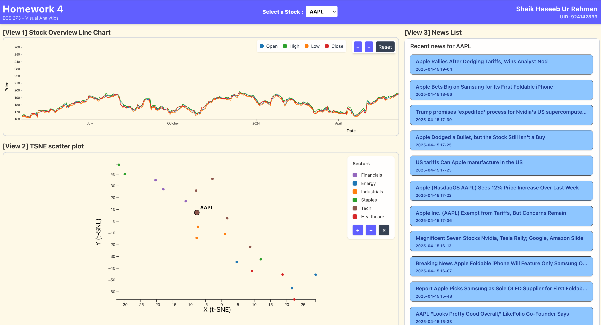

# Homework 4 - Make it Full Stack

## Steps to run the application

### [1] Environment Setup

- Navigate to the root folder: `./hrahman/`
- This folder contains two parts: client and server
- Setup up your enviroment using miniconda (optional)

```shell
conda create -n ecs273 python=3.12
conda activate ecs273
```

### [2] Server Setup

- Navigate to the folder `./hrahman/server`
- Install the required packages

```shell
pip install -r requirements.txt
```

### [3] Database Setup

- Start your local mongoDB server

>The following setup is for `mongodb-community@8.0` on Mac through homebrew! Refer the official documentation for different setup requirements.

```shell
brew tap mongodb/brew
brew update
brew install mongodb-community
brew services start mongodb-community
```

- Put data into database:

```shell
python import_data.py
```

### [4] API Server

- Finally, start your api server by,

```shell
uvicorn main:app --reload --port 8000
```

### [5] Client Setup

- Navigate to the folder `./hrahman/client`
- Install the required packages

```shell
cd ../client # If currently you are in the server folder
npm install
npm run dev
```

## Dashboard

> Though the website is responsive, it looks best at 80% zoom level!


